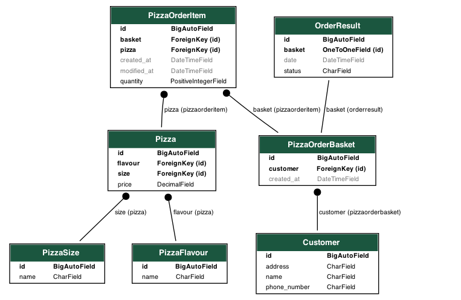

## Moberries challenge

### Prerequisites
  - docker
  - docker-compose


### How to set up and run
```shell
# creates docker image for backendserver (if does not exist already) and run database migrations
docker-compose run backendserver bootstrap

# Spins up backend server (and other services)
docker-compose up -d

# Creates a superuser, which you can use later to have access to django-admin dashboard
docker-compose run --entrypoint="" backendserver python manage.py createsuperuser

# Finally to remove containers (and related volumes)
docker-compose down -v
```

You can also visit:
- django admin dashboard on http://localhost:8000/admin
- API-docs on http://localhost:8000/swagger


### Relationships between models
The relationships between the models are as follows:

1. `PizzaSize` and `PizzaFlavour` models:
   - These models represent the sizes and flavors of pizzas, respectively.
   - There is a one-to-many relationship between `Pizza` and each of these models, as each pizza has a specific size and flavor.

2. `Pizza` model:
   - This model represents a pizza and its attributes.

3. `PizzaOrderItem` model:
   - This model represents an item (pizza) in a pizza order.
   - It has a many-to-one relationship with the `Pizza` model, as each order item corresponds to a specific pizza.
   - It also has a many-to-one relationship with the `PizzaOrderBasket` model, as each order item belongs to a specific order basket.

4. `Customer` model:
   - This model represents a customer who places pizza orders.
   - It is referenced by the `PizzaOrderBasket` model through a foreign key field (`customer`), indicating that each order basket belongs to a specific customer.

5. `PizzaOrderBasket` model:
   - This model represents a basket or container for pizza orders.
   - It has a many-to-one relationship with the `Customer` model, as each order basket belongs to a specific customer.
   - It also has a many-to-many relationship with the `Pizza` model through the `PizzaOrderItem` model, indicating that
   a basket can contain multiple pizzas and each pizza can be present in multiple baskets.

6. `OrderResult` model:
   - This model represents the result or status of a pizza order.
   - It has a one-to-one relationship with the `PizzaOrderBasket` model, as each order result corresponds to a specific order basket.


#### Quick visualization
